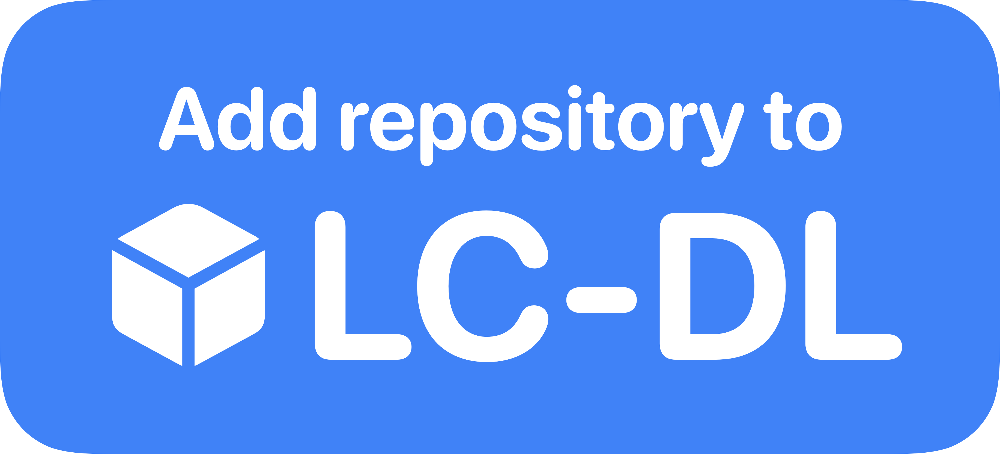
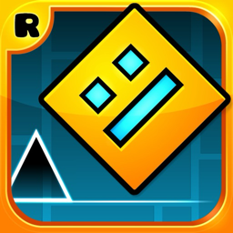

  <h1><b>LC-DL</b></h1>
  
A shortcut for LiveContainer, giving you access to a basic app store and making installing apps easier. This repo contains the shortcut as well as a starter repository of apps.

<h4 align="center">
  
[What is LC-DL?](https://github.com/sinceohsix/lcdl-repo?tab=readme-ov-file#what-is-lc-dl) | 
[How to install LC-DL](https://github.com/sinceohsix/lcdl-repo?tab=readme-ov-file#how-to-install-lc-dl) | 
[Usage](https://github.com/sinceohsix/lcdl-repo?tab=readme-ov-file#usage) | 
[App List](https://github.com/sinceohsix/lcdl-repo?tab=readme-ov-file#currently-available-apps)

  
`H1z8Ya`

</h4>

## What is LC-DL?
LC-DL is a shortcut to easily add apps to your LiveContainer. The shortcut works by directly adding the .app files to your LiveContainer folder. If an app comes with tweaks or need specific settings to be turned on, they will be setup automatically as well. This allows people to easily share apps for installation with LiveContainer with the least amount of setup required.

## How to install and use LC-DL
>[!Note]
This should go without saying but, **in order to use LC-DL you must already have LiveContainer setup and installed.**

### Installation:  
**Step 1:** Download the latest version of the shortcut from [here](https://github.com/sinceohsix/lcdl-repo/releases/tag/Shortcut).  
**Step 2.** Once downloaded, open the file in the shortcuts app, you will be prompted to add the shortcut.  
**Step 3.** Once the shortcut is installed, you are done!

### Usage:
#### Downloading apps directly:
In order to download apps using LC-DL you must either use a code or a button. Below you can find a list of available apps in this repository, there will be an "Install with LC-DL" button and a code below it for each app. You can press the button to install the app but if that doesn't work you can copy the code and paste it into the shortcut.

#### Downloading from a repository:
In order to download apps from a repository, you must first add one. You can also do this with either a code or an "Add repo to LC-DL" button. Upon importing the repository it will be saved locally to your device and when you run the shortcut you can select a repository, and then an app to install from it. You can add this repository using the button at the top of the page!

## Available Apps:
This is a list of every app currently available in this repository. If you have LC-DL installed you can tap the "Install" button to install it.
>[!Note]
Every app available on this repo has been tested and they are confirmed to work perfectly with LiveContainer, any necessary settings are already enabled.

|                                   **Icon**                                  |            **Name / Version**           |                                     **Install**                                    |
|:---------------------------------------------------------------------------:|:---------------------------------------:|:----------------------------------------------------------------------------------:|
|                      |      YTLitePlus `19.34.2-5.0.1`      |  `d4uazE` |
|                         |            MeloNX `1.7.0`            |  `tciNqC` |
|  |         DolphiniOS `4.0.0b8`         |  `WdGNX2` |
|                      |             Folium `1.20`            |  `hcJGhD` |
|                          |     Eevee Spotify `9.0.40-3.3.13`    |  `bigeKH` |
|                     | Geometry Dash `2.207 (Geode v4.4.0)` |  `vZTNwL` |
|                   |    Five Nights at Freddy's `2.0.5`   |  `eoW4Xs` |
|                        |   Five Nights at Freddy's 2 `2.0.5`  |  `eMJG3h` |
|                     |          Bloons TD 6 `48.2`          |  `egqCrr` |
|                 |    Minecraft Preview `1.21.90.23`    |  `93aVMb` |
|                    |       GTA: San Andreas `2.2.20`      |  `RnargQ` |
