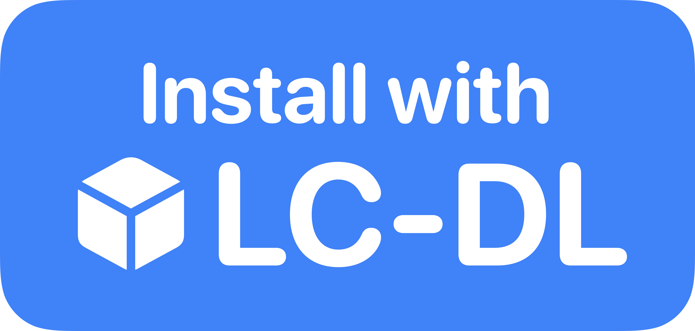

   
   
  
An iOS shortcut for LiveContainer that allows you to easily download apps from the internet! This repo contains the shortcut, apps are available in a seperate repository, more info below.

  Compatible with iOS 18+
  
  LC-DL is made with ❤️ by Eli and Kaylley!

  <h4>

[What is LC-DL?](https://github.com/sinceohsix/lcdl-repo?tab=readme-ov-file#what-is-lcdl)  
[Setup and Usage](https://github.com/sinceohsix/lcdl-repo?tab=readme-ov-file#setup-usage)   
[The LC-DL App Repository](https://github.com/sinceohsix/lcdl-repo?tab=readme-ov-file#repository)  
[Documentation](https://github.com/sinceohsix/lcdl-repo/wiki)

  </h4>

 

 
LC-DL is an iOS shortcut to easily download apps to LiveContainer. The shortcut works by directly adding the .app file to your LiveContainers `Applications` folder. Apps can also come with tweak and/or data folders and will have necessary LiveContainer settings pre-configured. This allows you to install apps without any setup required! You can also download apps from repositories that are made specifically for LiveContainer!
   

### Setup:  

>[!Note]
LC-DL is an iOS Shortcut, meaning the Shortcuts app needs to be installed. It comes with your iPhone but if you deleted it, download it again from [here](https://apps.apple.com/us/app/shortcuts/id1462947752).

To install LC-DL either:
1. Go to the [releases](https://github.com/sinceohsix/lcdl-repo/releases/latest) page.
2. Download the latest `LC-DL.shortcut` file.
3. Open `LC-DL.shortcut` in the shortcuts app.
4. Set the shortcut up by selecting the `On My iDevice > LiveContainer` folder.
5. Turn the "Allow Sharing Large Amounts of Data" setting on in the settings of the shortcut app, found within the regular iOS settings.

or... You can get it from [this](https://www.icloud.com/shortcuts/c17b6696014d4107835a67febd9202d4) iCloud Link. Please make sure you still follow the setup directions.

### Usage:
**Codes:**  
LC-DL is powered by 6-character codes. These codes can be linked to either repositories or individual apps. You can enter them by tapping "➕ Enter Code" after running LC-DL.

**Buttons:**  
There are also LC-DL buttons that will automatically fetch the app or repository for the code they link to. They look like this  and this . Depending on what the button is for, either an app or repository, tapping the button will prompt to download the app or add the repository!

**Repositories:**  
You can add a repository with a 6-character code or by tapping this  button where you see it. You can view saved repositories on LC-DL by running the shortcut and selecting "🌐 View Repositories". After selecting a repository, you can choose an app to download from it.

**LC2HS Integration:**  
[LC2HS](https://github.com/lc-dl/lc2hs) is another shortcut I've made that allows you to easily add your LiveContainer apps to your home screen. If you have both LC-DL and LC2HS setup, you will be asked if you want to add your newly installed app to your homescreen automatically!
  

 

LC-DL has a repository of great apps and games to get you started, [**check it out**](https://github.com/lc-dl/apps) or tap the button below to add the repository to LC-DL!

The LC-DL App Repository has over 40 apps and games and there is *at least* one app for everyone! There are even ways for *you* to contribute to the repository!

  

### Special Thanks
[@suprstarrd](https://github.com/suprstarrd) • Gave helpful info regarding LCAppInfo.plist  
[@kaylleylol](https://github.com/kaylleylol) • She claims she helped with all of it lol
@**you!** • Thank you for checking out my project! Your support means the world!

<b>DISCLAIMER:</b> 
NEITHER ME (@sinceohsix) OR LC-DL AS A PROJECT ARE AFFILIATED WITH LIVECONTAINER OR ITS DEVELOPERS! This project is a  seperate thing built for the love of sideloading. Please don't ask the LiveContainer developers for support with using LC-DL, they are not obligated to help you with this shortcut. LiveContainer is a great app, if you starred LC-DL, make sure you star LiveContainer as well, they deserve it! Thank you for reading.

Copyright 2025 OHSIX
